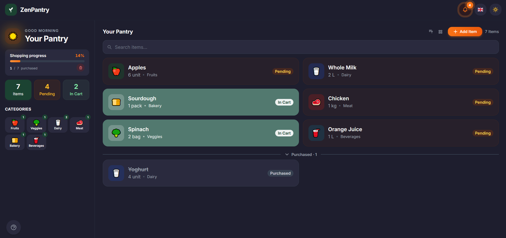
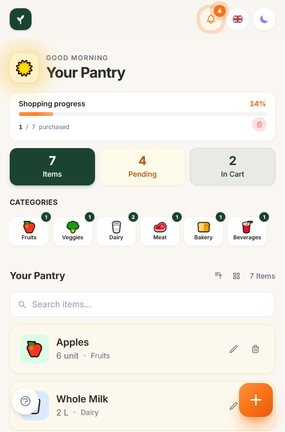

<div align="center">

# ZenPantry

**Smart home pantry & shopping list — mobile‑first, with soul.**


</div>

---

<!-- ENGLISH -->
# 🇬🇧 English

## Design

<table>
  <tr>
    <td align="center"><strong>Desktop — Dark mode</strong></td>
    <td align="center"><strong>Mobile — Light mode</strong></td>
  </tr>
  <tr>
    <td></td>
    <td></td>
  </tr>
</table>

---

## About

ZenPantry is a mobile‑first web app for managing your home pantry and shopping list. Add items, track their status through a visual cycle, filter and search, and switch language at runtime — no server required, everything stored locally.

---

## Features

| Feature | Details |
|---|---|
| **Full CRUD** | Add, edit and delete pantry items with name, quantity, unit, category and status |
| **Status cycle** | Tap any item to advance: Pending → In Cart → Purchased → Pending |
| **Confirm dialogs** | Destructive actions (delete item, clear purchased) require explicit confirmation |
| **Category filter** | Tap a category card in the sidebar to filter instantly; tap again to clear |
| **Status filter** | Tap a stat card (pending / in cart) to filter by status |
| **Combined filters** | Category and status filters work simultaneously |
| **Search** | Live search bar filters items by name as you type |
| **Sort** | Cycle through Default / A–Z / Category with one tap |
| **Compact view** | Toggle a denser layout to see more items at once |
| **Notification bell** | Panel showing all pending items; move one or all to cart in one tap |
| **Progress bar** | Visual shopping progress with animated fill and percentage |
| **Clear purchased** | Remove all purchased items in one action, with undo support |
| **Undo toasts** | Every destructive action (delete, clear) offers a 5‑second undo |
| **Help tour** | 6‑step onboarding with hero illustrations, progress bar, swipe and keyboard support |
| **Dark mode** | Tailwind `dark:` classes, preference saved in LocalStorage |
| **Two languages** | English and Portuguese (PT‑PT) via ngx‑translate v17, switching at runtime |
| **Persistence** | LocalStorage — data and preferences preserved between reloads |
| **Responsive** | FAB on mobile, inline "Add Item" button on desktop |

---

## Getting started

```bash
npm install
ng serve
```

The app is available at `http://localhost:4200`.

---

## Architecture

<details>
<summary>View folder structure</summary>

```
public/
  assets/i18n/
    en.json              # English translations
    pt-PT.json           # Portuguese (PT‑PT) translations

src/app/
  core/
    constants/
      storage-keys.ts          # LocalStorage key registry
    models/
      item.model.ts            # Types + constants (ItemCategory, ItemStatus, CATEGORY_CONFIG …)
    services/
      data.service.ts          # CRUD + LocalStorage (Signals + computed stats)
      theme.service.ts         # Dark/light mode (Signal + effect)
      toast.service.ts         # Notification queue with auto‑dismiss (Signal)

  shared/
    header/
      header.component.ts      # Fixed top bar — bell panel, theme toggle, language switcher
      header.component.html
    components/
      language-switcher/       # Flag-only EN / PT toggle button
      toast/                   # Toast overlay with undo action support
      confirm-dialog/          # Reusable alert dialog with scroll lock
      help-tour/               # 6‑step onboarding modal with swipe + keyboard nav

  features/
    home/
      home-page/
        home-page.component.ts   # Main view — sidebar (stats, categories) + item list + search/sort
        home-page.component.html
    pantry/
      filter-bar/
        filter-bar.component.ts  # Stateless status + category filter bar
        filter-bar.component.html
      item-form/
        item-form.component.ts   # Create / edit bottom sheet (reactive form, category‑aware units)
        item-form.component.html
      item-list/
        item-list.component.ts   # Item cards, compact mode, purchased section
        item-list.component.html
      pantry-page/
        pantry-page.component.ts
        pantry-page.component.html

  app.ts                       # Root component
  app.config.ts                # Providers — router, HTTP, translate, APP_INITIALIZER
  app.routes.ts                # Lazy‑loaded route to HomePageComponent
```

</details>

---

## Technical Decisions

### Template separation — `.ts` + `.html` per component

**Decision:** all component templates are extracted into dedicated `.html` files. Each component folder contains a `.ts` (class + metadata) and a `.html` (template only). No `.css` files — all styling is Tailwind utility classes.

**Why?** As the app grew, inline templates inside TypeScript strings became hard to navigate, broke IDE HTML tooling (auto‑complete, formatting, linting), and made code reviews noisy. Separate files restore correct HTML language services, keep the TypeScript class readable, and align with production Angular conventions.

---

### Angular Signals over RxJS

**Decision:** all reactive state — item list, filters, stats, toasts, theme — is managed with `signal()` and `computed()`.

**Why?** The state is synchronous and local. Signals integrate natively with `ChangeDetectionStrategy.OnPush` without subscriptions, `async` pipe, or manual teardown. Reactivity is tracked automatically by Angular's runtime, making the data flow trivial to follow and debug.

---

### `toSignal` for Observable → Signal bridge in OnPush components

**Decision:** `toSignal()` from `@angular/core/rxjs-interop` converts `onLangChange` (Observable) and reactive form control streams into Signals.

**Why?** `ChangeDetectionStrategy.OnPush` does not react to plain Observable emissions — it would require manual `markForCheck()` calls. `toSignal` wraps an Observable in a Signal that Angular tracks automatically, keeping components fully push‑based without any subscription management.

---

### Discriminated union for pending delete state

**Decision:** the `pendingDelete` signal holds a typed discriminated union:

```typescript
type PendingDelete =
  | { type: 'item'; id: string; name: string }
  | { type: 'clear'; count: number };
```

**Why?** A single signal drives both "delete one item" and "clear all purchased" dialogs. The discriminated union makes the type narrowing explicit and exhaustive — the `confirmDelete()` handler knows exactly which branch it is in at compile time, with no optional fields or runtime `instanceof` checks.

---

### Confirm dialog with z-index management and scroll lock

**Decision:** the `ConfirmDialogComponent` uses `z-50` (the highest default Tailwind z-index), locks page scroll via `document.documentElement.classList.add('overflow-hidden')` on mount, and cleans up via `DestroyRef.onDestroy`.

**Why?**
- Tailwind v3's default scale tops out at `z-50`. Using `z-60` generates no CSS — the backdrop would appear below other `z-10` elements.
- Mobile browsers (iOS Safari, Android Chrome) render native overlay scrollbars at the OS compositor level, **above all CSS z-index**. Locking scroll via the `overflow-hidden` class removes the scrollbar from the compositor entirely, making the backdrop truly full-screen.
- The categories horizontal scroll container additionally toggles `overflow-hidden` ↔ `overflow-x-auto` while the dialog is open, eliminating a second scrollbar that would otherwise composite above the backdrop.

---

### APP_INITIALIZER for i18n preloading

**Decision:** a custom `APP_INITIALIZER` calls `translate.use(savedLang)` and resolves its Promise before Angular renders any component. A `catchError` fallback ensures English always loads even if a locale file is missing.

**Why?** Without this, components render before translations are available, causing a flash of untranslated keys (FOTC). Blocking bootstrap with `APP_INITIALIZER` guarantees every template is evaluated with a populated translation dictionary.

---

### ngx‑translate over `@angular/localize`

**Decision:** internationalisation via `ngx‑translate v17` with the `provideTranslateService()` + `provideTranslateHttpLoader()` API.

**Why?** `@angular/localize` requires a separate build per language and cannot switch at runtime. `ngx‑translate` loads JSON files via HTTP and swaps the language instantly — essential for a SPA where the user can change language without reloading.

---

### `ChangeDetectionStrategy.OnPush` on every component

**Decision:** all components declare `changeDetection: ChangeDetectionStrategy.OnPush`.

**Why?** Combined with Signals, Angular re‑renders a component only when its inputs change or a Signal it reads emits a new value. This eliminates redundant checks across the tree and keeps the UI smooth even as the list grows.

---

### Tailwind JIT — class strings must be complete literals

**Decision:** all conditional Tailwind classes are written as full literal strings in class‑returning methods (e.g. `cardClass()`, `statusPill()`). No dynamic interpolation of color or variant tokens.

**Why?** Tailwind's JIT scanner performs a static text search across source files. A string like `` `bg-${color}-500` `` is never scanned — the resulting class is never generated in the CSS bundle. Complete literals guarantee the class is included regardless of how it is referenced.

---

### Responsive action pattern — FAB on mobile, inline button on desktop

**Decision:** the primary "Add item" action is a fixed FAB (`rounded-2xl`, orange gradient with shimmer + float animation) on mobile, hidden on `md+`. On desktop an inline button with the same gradient appears in the list toolbar.

**Why?** A FAB is a well‑established mobile pattern but an anti‑pattern on desktop — it floats over content with no clear spatial relationship to the list it acts on. The toolbar button places the action where desktop users expect it: adjacent to sort and view controls.

---

### Microinteraction system — animate-float, animate-shimmer, group-hover

**Decision:** the FAB and desktop button use `animate-float` (gentle vertical bob), a shimmer sweep span (`-skew-x-12 bg-gradient-to-r via-white/30`, translates on `group-hover`), and icon rotation (`group-hover:rotate-90`) — all via custom Tailwind keyframes in `tailwind.config.js`.

**Why?** Microinteractions communicate affordance (this is tappable), acknowledge input (the icon rotates on hover), and provide delight without blocking the user. All animations use `transform` and `opacity` — GPU‑composited properties that never trigger layout reflow.

---

### Desktop card edit/delete placement

**Decision:** on desktop (`lg+`), edit and delete action buttons appear **to the left of the status pill**, hidden by default (`opacity-0 translate-x-2`) and revealed on `group-hover`. On mobile they are always visible.

**Why?** Placing actions adjacent to the status pill creates a clear visual grouping — the pill identifies the item's state, the buttons act on it. Hiding them until hover keeps the card list scannable and uncluttered on desktop, while mobile always shows them for discoverability on touch devices.

---

### Help tour — swipe, keyboard, and per-step illustrations

**Decision:** the `HelpTourComponent` supports left/right touch swipe (50 px delta threshold), `ArrowLeft`/`ArrowRight`/`Escape` keyboard shortcuts via `@HostListener`, and renders a unique SVG/HTML illustration per step using `@switch`.

**Why?** The `@for + @if` pattern re-inserts the slide DOM node on each navigation, which re-triggers `animate-fade-in` without needing manual animation state management. Step illustrations use inline SVG and Tailwind classes (not images) so they adapt to dark mode automatically via `dark:` variants.

---

### Tailwind `dark:` with the `class` strategy

**Decision:** `darkMode: 'class'` in `tailwind.config.js`; `ThemeService` adds/removes the `dark` class on `<html>` and persists the choice to LocalStorage.

**Why?** The `class` strategy decouples the theme from the OS preference, lets the user override the system setting, and guarantees the preference survives page reloads without a flash of the wrong theme.

---

### Assets in `public/` instead of `src/assets/`

**Decision:** translation JSON files and other static assets live under `public/`.

**Why?** From Angular 17+, `public/` is the recommended static directory. The build pipeline includes its contents automatically, making assets available without additional `angular.json` configuration or manual copy rules.

---

## Tech stack

| Technology | Version | Purpose |
|---|---|---|
| Angular | 21 | Standalone components, Signals, lazy‑loaded routes |
| Tailwind CSS | v3 | Mobile‑first, dark mode via class, custom keyframe animations |
| ngx‑translate | v17 | Runtime i18n — EN / PT‑PT |
| TypeScript | 5.9 | Strict mode, zero `any` |

---
---

<!-- PORTUGUÊS -->
# 🇵🇹 Português

## Design

<table>
  <tr>
    <td align="center"><strong>Desktop — Modo escuro</strong></td>
    <td align="center"><strong>Mobile — Modo claro</strong></td>
  </tr>
  <tr>
    <td></td>
    <td></td>
  </tr>
</table>

---

## Sobre o projeto

ZenPantry é uma aplicação web mobile‑first para gerir a dispensa doméstica e a lista de compras. Adiciona itens, acompanha o estado de cada produto, filtra, pesquisa e troca de idioma em tempo real — sem servidor, com dados guardados localmente.

---

## Funcionalidades

| Funcionalidade | Detalhe |
|---|---|
| **CRUD completo** | Adicionar, editar e eliminar itens com nome, quantidade, unidade, categoria e estado |
| **Ciclo de estado** | Toque num item para avançar: Pendente → No Carrinho → Comprado → Pendente |
| **Diálogos de confirmação** | Ações destrutivas (eliminar item, limpar comprados) requerem confirmação explícita |
| **Filtro por categoria** | Toque numa categoria na barra lateral para filtrar; toque novamente para limpar |
| **Filtro por estado** | Toque num cartão de estatística (pendente / carrinho) para filtrar por estado |
| **Filtros combinados** | Categoria e estado funcionam em simultâneo |
| **Pesquisa** | Barra de pesquisa em tempo real filtra itens pelo nome |
| **Ordenação** | Alterne entre Padrão / A–Z / Categoria com um toque |
| **Vista compacta** | Layout mais denso para ver mais itens ao mesmo tempo |
| **Sino de notificações** | Painel com todos os itens pendentes; mova um ou todos para o carrinho de uma vez |
| **Barra de progresso** | Progresso visual das compras com preenchimento animado e percentagem |
| **Limpar comprados** | Remove todos os itens comprados de uma vez, com suporte a desfazer |
| **Toasts com desfazer** | Cada ação destrutiva (eliminar, limpar) oferece 5 segundos para desfazer |
| **Tour de ajuda** | Onboarding de 6 passos com ilustrações, barra de progresso, swipe e teclado |
| **Modo escuro** | Classes `dark:` do Tailwind, preferência guardada em LocalStorage |
| **Dois idiomas** | Inglês e Português (PT‑PT) via ngx‑translate v17, troca em tempo real |
| **Persistência** | LocalStorage — dados e preferências mantidos entre recarregamentos |
| **Responsivo** | FAB no mobile, botão inline "Adicionar Item" no desktop |

---

## Iniciar a aplicação

```bash
npm install
ng serve
```

A app fica disponível em `http://localhost:4200`.

---

## Arquitetura

<details>
<summary>Ver estrutura de pastas</summary>

```
public/
  assets/i18n/
    en.json              # Traduções em inglês
    pt-PT.json           # Traduções em português (PT‑PT)

src/app/
  core/
    constants/
      storage-keys.ts          # Registo de chaves do LocalStorage
    models/
      item.model.ts            # Tipos + constantes (ItemCategory, ItemStatus, CATEGORY_CONFIG …)
    services/
      data.service.ts          # CRUD + LocalStorage (Signals + computed stats)
      theme.service.ts         # Modo escuro/claro (Signal + effect)
      toast.service.ts         # Fila de notificações com auto‑dismiss (Signal)

  shared/
    header/
      header.component.ts      # Barra superior fixa — painel do sino, tema, idioma
      header.component.html
    components/
      language-switcher/       # Botão de troca de idioma (só bandeira)
      toast/                   # Overlay de toasts com suporte a desfazer
      confirm-dialog/          # Diálogo de alerta reutilizável com scroll lock
      help-tour/               # Modal de onboarding de 6 passos (swipe + teclado)

  features/
    home/
      home-page/
        home-page.component.ts   # Vista principal — sidebar (stats, categorias) + lista + pesquisa/ordenação
        home-page.component.html
    pantry/
      filter-bar/
        filter-bar.component.ts  # Barra de filtros stateless (estado + categoria)
        filter-bar.component.html
      item-form/
        item-form.component.ts   # Bottom sheet de criação/edição (formulário reativo, unidades por categoria)
        item-form.component.html
      item-list/
        item-list.component.ts   # Cards de itens, vista compacta, secção de comprados
        item-list.component.html
      pantry-page/
        pantry-page.component.ts
        pantry-page.component.html

  app.ts                       # Componente raiz
  app.config.ts                # Providers — router, HTTP, translate, APP_INITIALIZER
  app.routes.ts                # Rota lazy‑loaded para HomePageComponent
```

</details>

---

## Decisões Técnicas

### Separação de templates — `.ts` + `.html` por componente

**Decisão:** todos os templates dos componentes foram extraídos para ficheiros `.html` dedicados. Cada pasta de componente contém um `.ts` (classe + metadados) e um `.html` (template apenas). Sem ficheiros `.css` — todo o styling usa classes Tailwind.

**Porquê?** À medida que a app cresceu, os templates inline dentro de strings TypeScript tornaram-se difíceis de navegar, quebraram as ferramentas de HTML do IDE (auto-complete, formatação, linting) e tornaram as revisões de código mais confusas. Ficheiros separados restauram os language services HTML corretos, mantêm a classe TypeScript legível e alinham com as convenções Angular de produção.

---

### Angular Signals em vez de RxJS

**Decisão:** todo o estado reativo — lista de itens, filtros, estatísticas, toasts, tema — é gerido com `signal()` e `computed()`.

**Porquê?** O estado é síncrono e local. Signals integram‑se nativamente com `ChangeDetectionStrategy.OnPush` sem subscriptions, `async pipe` ou teardown manual. A reatividade é rastreada automaticamente pelo runtime do Angular.

---

### `toSignal` como ponte Observable → Signal em componentes OnPush

**Decisão:** `toSignal()` de `@angular/core/rxjs-interop` converte `onLangChange` (Observable) e streams de reactive forms em Signals.

**Porquê?** `ChangeDetectionStrategy.OnPush` não reage a emissões de Observables simples — exigiria chamadas manuais a `markForCheck()`. `toSignal` envolve um Observable num Signal que o Angular rastreia automaticamente.

---

### União discriminada para o estado de eliminação pendente

**Decisão:** o signal `pendingDelete` contém uma união discriminada tipada:

```typescript
type PendingDelete =
  | { type: 'item'; id: string; name: string }
  | { type: 'clear'; count: number };
```

**Porquê?** Um único signal controla os diálogos de "eliminar um item" e "limpar todos os comprados". A união discriminada torna o narrowing de tipo explícito e exaustivo — o handler `confirmDelete()` sabe exatamente em que ramo está em tempo de compilação, sem campos opcionais.

---

### Diálogo de confirmação com gestão de z-index e scroll lock

**Decisão:** o `ConfirmDialogComponent` usa `z-50` (o z-index mais alto por defeito no Tailwind), bloqueia o scroll via `document.documentElement.classList.add('overflow-hidden')` no mount, e limpa via `DestroyRef.onDestroy`.

**Porquê?**
- A escala por defeito do Tailwind v3 termina em `z-50`. Usar `z-60` não gera CSS — o backdrop apareceria abaixo de elementos com `z-10`.
- Os browsers mobile (iOS Safari, Android Chrome) renderizam scrollbars nativas ao nível do compositor do SO, **acima de qualquer z-index CSS**. Bloquear o scroll via `overflow-hidden` remove a scrollbar do compositor, tornando o backdrop verdadeiramente fullscreen.
- O contentor de scroll horizontal das categorias alterna adicionalmente `overflow-hidden` ↔ `overflow-x-auto` enquanto o diálogo está aberto, eliminando uma segunda scrollbar que compositaria acima do backdrop.

---

### APP_INITIALIZER para pré‑carregamento do i18n

**Decisão:** um `APP_INITIALIZER` personalizado chama `translate.use(savedLang)` e resolve a sua Promise antes do Angular renderizar qualquer componente.

**Porquê?** Sem isto, os componentes renderizam antes das traduções estarem disponíveis, causando um flash de chaves não traduzidas (FOTC). Bloquear o bootstrap com `APP_INITIALIZER` garante que cada template é avaliado com o dicionário de traduções preenchido.

---

### ngx‑translate em vez de `@angular/localize`

**Decisão:** internacionalização via `ngx‑translate v17` com a API `provideTranslateService()` + `provideTranslateHttpLoader()`.

**Porquê?** `@angular/localize` requer um build separado por idioma e não suporta troca em runtime. `ngx‑translate` carrega ficheiros JSON via HTTP e troca o idioma instantaneamente.

---

### `ChangeDetectionStrategy.OnPush` em todos os componentes

**Decisão:** todos os componentes declaram `changeDetection: ChangeDetectionStrategy.OnPush`.

**Porquê?** Combinado com Signals, o Angular só re‑renderiza um componente quando os seus inputs mudam ou um Signal que lê emite um novo valor, eliminando verificações redundantes em toda a árvore.

---

### Tailwind JIT — strings de classes devem ser literais completos

**Decisão:** todas as classes Tailwind condicionais são escritas como strings literais completas nos métodos que retornam classes (e.g. `cardClass()`, `statusPill()`). Sem interpolação dinâmica de tokens de cor ou variante.

**Porquê?** O scanner JIT do Tailwind faz uma pesquisa de texto estático nos ficheiros fonte. Uma string como `` `bg-${color}-500` `` nunca é encontrada — a classe resultante nunca é gerada no bundle CSS.

---

### Padrão de ação responsivo — FAB no mobile, botão inline no desktop

**Decisão:** a ação principal "Adicionar item" é um FAB fixo (`rounded-2xl`, gradiente laranja com shimmer + animação float) no mobile. No desktop aparece um botão inline na toolbar da lista com o mesmo gradiente.

**Porquê?** O FAB é um padrão consolidado no mobile, mas um anti‑padrão no desktop — flutua sobre o conteúdo sem relação espacial clara. O botão na toolbar coloca a ação onde o utilizador de desktop a espera.

---

### Sistema de microinterações — animate-float, animate-shimmer, group-hover

**Decisão:** o FAB e o botão desktop usam `animate-float` (oscilação vertical suave), um sweep de shimmer (`-skew-x-12 bg-gradient-to-r via-white/30`, translada no `group-hover`), e rotação do ícone (`group-hover:rotate-90`) — todos via keyframes personalizados no `tailwind.config.js`.

**Porquê?** As microinterações comunicam affordance, confirmam input e proporcionam prazer sem bloquear o utilizador. Todas as animações usam `transform` e `opacity` — propriedades compostas pela GPU que nunca disparam reflow de layout.

---

### Posicionamento dos botões de editar/eliminar nos cards (desktop)

**Decisão:** no desktop (`lg+`), os botões de editar e eliminar aparecem **à esquerda do pill de estado**, ocultos por defeito (`opacity-0 translate-x-2`) e revelados no `group-hover`. No mobile estão sempre visíveis.

**Porquê?** Colocar as ações adjacentes ao pill de estado cria um agrupamento visual claro — o pill identifica o estado do item, os botões agem sobre ele. Ocultá-los até hover mantém a lista de cards legível no desktop.

---

### Tour de ajuda — swipe, teclado e ilustrações por passo

**Decisão:** o `HelpTourComponent` suporta swipe táctil esquerda/direita (threshold de 50 px), atalhos de teclado `ArrowLeft`/`ArrowRight`/`Escape` via `@HostListener`, e renderiza uma ilustração única por passo usando `@switch`.

**Porquê?** O padrão `@for + @if` re-insere o nó DOM do slide em cada navegação, re-disparando `animate-fade-in` sem precisar de gestão manual de estado de animação. As ilustrações usam SVG inline e classes Tailwind (não imagens), adaptando-se automaticamente ao modo escuro via variantes `dark:`.

---

### Tailwind `dark:` com estratégia `class`

**Decisão:** `darkMode: 'class'` no `tailwind.config.js`; o `ThemeService` adiciona/remove a classe `dark` no `<html>` e persiste a escolha em LocalStorage.

**Porquê?** A estratégia `class` desacopla o tema da preferência do sistema operativo e garante que a escolha persiste entre sessões sem flash do tema errado.

---

### Assets em `public/` em vez de `src/assets/`

**Decisão:** os ficheiros JSON de tradução e outros assets estáticos residem em `public/`.

**Porquê?** A partir do Angular 17+, `public/` é o diretório estático recomendado, incluído automaticamente pelo pipeline de build sem configuração adicional no `angular.json`.

---

## Tecnologias

| Tecnologia | Versão | Utilização |
|---|---|---|
| Angular | 21 | Standalone components, Signals, rotas lazy‑loaded |
| Tailwind CSS | v3 | Mobile‑first, dark mode via class, animações keyframe personalizadas |
| ngx‑translate | v17 | i18n em runtime — EN / PT‑PT |
| TypeScript | 5.9 | Modo estrito, zero `any` |
